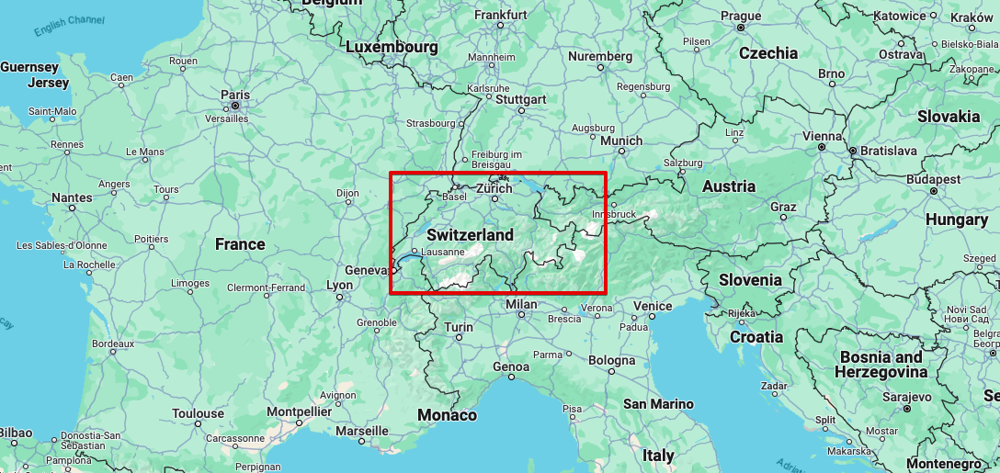

# Demo Streamlit with Kafka and Flink  


# How to run the demo

1. Copy `config.template.yml` into `config.yml` and fill in the values.
2. Install JR via `brew install jr`
3. Run JR to generate some data to the `user`topic. Change the duration if needed.
    ```shell
    jr run user -n 10 -f 0.5s -d 100s -o kafka -s --serializer avro-generic -t user
    ```
4. Run `streamlit run dashboard_with_flink.py`.

This is what you should see: 


